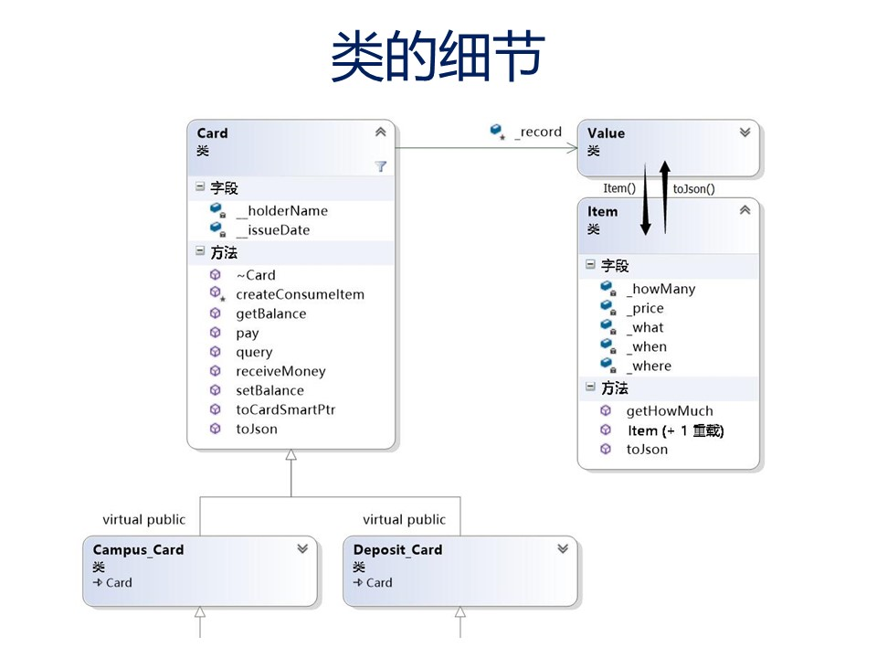

# 实验报告

- 项目题目: Project3 校园电子卡管理系统
- 实验人: **何志宇**
- 学号: **15331097**
- 日期: 2016-5-23
- 院系: 数据科学与计算机学院
- 专业(班级): 软件工程3班

## 一. 实验目的
学会灵活运用: 面向对象程序设计三大件:
(O)封装, (O)继承, (P)多态

## 二. 实验环境

### 2.1 编程语言和开发工具
- 编程语言： `C++(11)`
- 开发工具(IDE)： `MS Visual Studio 2015`
- 编辑器: `Sublime Text 3`

### 2.2 编码规范
- 编码规范: 基于`Google C++ Style`

## 三. 实验成果

## 四、设计心得
OOP程序设计多态性的使用

## 五、不足
测试单元需要完善, 下次需要尝试使用`Makefile`